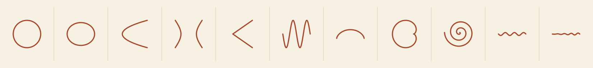

A physical instrument — four modules plus a bonus attachment set — that draws any conic
section by eccentricity: **circle, ellipse, parabola, hyperbola, and a pair of crossing
lines.** Turn the same idea a little further and it also draws a **sine wave, cycloid,
cardioid, Archimedean spiral, helix, and spiralling helix.**

[**▶ Try the live demo**](https://SKJainDr.github.io/mech-curve-generator/demo/conic_curve_generator_demo.html) ·
[Blueprints](https://SKJainDr.github.io/mech-curve-generator/blueprints/index.html) ·
[GitHub Pages site](https://SKJainDr.github.io/mech-curve-generator/)



---

## What this is

Every conic section — circle, ellipse, parabola, hyperbola — is the same underlying curve,
distinguished by a single number: **eccentricity**. This project builds that idea into an
actual mechanical instrument, starting from the classic "circles can draw a straight line"
trick (the **Tusi couple**), which turns out to be mathematically identical to a much older
drafting tool, the **Trammel of Archimedes**.

From there the instrument grows into four interchangeable modules — one per required conic,
plus a fifth for the pair-of-lines degenerate case — sharing one visual and mechanical
language (M6 hardware, 6mm ply, the same pen-and-thread logic). A bonus module reuses the
same rolling-circle idea to add six more classic curves.

This repo contains three things:

1. **Build blueprints** — true-to-scale (1 SVG unit = 1mm), dimensioned cutting templates
with a full bill of materials, so you can build the physical instrument.
2. **An interactive HTML demo** — a browser-based simulation of the same mechanisms, with a
guided tour that draws all eleven curves in sequence, and a manual mode to drive any one
of them yourself.
3. **This landing page** (`index.html`) — a GitHub Pages front door tying both together.

## Repo layout

```
.
├── index.html                                    # GitHub Pages landing page
├── README.md                                     # this file
├── site.webmanifest                              # app icon manifest
├── assets/
│   ├── logo.svg / logo-wide.svg                  # lockups: mark + wordmark, for docs/headers
│   ├── icon-mark.svg                              # mark alone, transparent
│   ├── icon-tile.svg / icon-tile-square.svg       # mark on a filled tile, source for app icons
│   ├── favicon.svg / favicon.ico                  # browser tab icon
│   ├── apple-touch-icon.png                       # iOS home-screen icon (180×180)
│   ├── icon-16/32/48/64/96/192/512.png            # rasterised icon sizes
│   ├── social-preview.png                         # Open Graph / Twitter card image (1200×630)
│   └── hero.svg                                   # banner strip of all 11 curves
├── demo/
│   └── conic_curve_generator_demo.html           # standalone interactive demo (open directly, no server needed)
├── blueprints/
│   ├── index.html                                 # blueprint previews + downloads (linked from the site nav)
│   ├── conic_generator_build_blueprint.svg        # Modules 1–4: the five required conics
│   └── module_c_bonus_attachments_blueprint.svg   # Module C: rolling disc, spiral arm, helix, spiralling helix
└── assembly/
    ├── index.html                                 # interactive 3D assembly viewer (rotate + explode each module)
    └── modules_data.js                            # part geometry (position, size, colour) for every module
```

All four HTML pages (`index.html`, `demo/…`, `blueprints/index.html`, `assembly/index.html`)
share the same header (logo + cross-links to the other pages) and footer, so you can land on
any of them and still get around the whole site.

Everything is static — no build step, no server-side dependencies. `index.html` and everything
under `demo/`, `blueprints/`, and `assembly/` can be opened directly from disk (the assembly
viewer needs internet access once, to load Three.js from a CDN) or served as-is by GitHub Pages
from the repo root (**Settings → Pages → Deploy from branch → `/ (root)`**).

## The five required conics

|Module|Mechanism|Draws|Parameter|
|-|-|-|-|
|1|Elliptical trammel (two perpendicular slots + sliding beam)|Circle, ellipse, degenerate straight line|`b = a·√(1−e²)`|
|2|Focus & directrix rig (T-square + taut thread)|Parabola|thread length = focus–directrix distance `p`|
|3|Two-focus rod & thread|Hyperbola|`e = c/a`|
|4|Angle-lock ruler pair|Pair of straight lines|`e = sec(α/2)`|

Module 1 is the odd one out on purpose: a circle is just the trammel at `e = 0`, so it isn't
a separate mechanism — only a separate name for the same beam at a different setting.

## Six more curves, same idea

|Attachment|Draws|Principle|
|-|-|-|
|Scotch yoke|Sine wave|rotating pin's height, `y = R·sin θ`, read off against constant-speed feed|
|Rolling disc on a rail|Cycloid|circle of radius `r` rolling without slipping along a straight track|
|Rolling disc on a fixed disc|Cardioid|same disc, rolling around an equal fixed disc instead|
|Traverse-rate unit → radial slider|Archimedean spiral|friction-drive at slot position `s` gives `ρ = k·s`, so `r = ρ·θ`, continuously adjustable|
|Crank + traverse-rate unit → axial carriage|Helix (side view)|Scotch-yoke crank sets radius `r`; a second traverse-rate unit sets pitch, `x = k·θ`|
|Two traverse-rate units (radial + axial)|Spiralling / conical helix|helix's axial unit for pitch, plus a radial one for flare rate — both stepless|

The spiral, helix, and spiralling-helix attachments all share one part, the **traverse-rate
unit**: a slotted friction-drive that reads out its growth-rate or pitch directly from the
slot position, the same slot-and-clamp principle as the trammel's beam — no fixed posts or
swappable parts, genuinely stepless. See the Module C blueprint for the full mechanism.

## Building the physical instrument

Both blueprint SVGs are drawn at **1 unit = 1mm** — open them in Inkscape/Illustrator and
either print at 100% as a cutting template or feed them straight to a laser cutter/CNC. Each
sheet includes a scale bar, a bill of materials, and per-part dimensions.

Everything is 6mm ply/MDF or acrylic, joined with M6 bolts, wingnuts, and washers (sized
wider than the slots they ride in), plus low-stretch thread for the parabola and hyperbola
modules. No custom machining beyond what a scroll saw, laser cutter, or careful hand-cutting
can do.

Two build notes that matter more than they look:

* **Grip beats precision** on the rolling-disc attachment — a slipping rim skids instead of
rolling and visibly kinks the curve. Line the disc rim and its track with matching rubber
or fine sandpaper.
* **The spiral's pencil slider must stay genuinely free** — it's the one part in the whole
instrument that *isn't* clamped. Any friction there stretches the cord instead of pulling
the slider smoothly, and flattens the spiral.

## The demo

`demo/conic_curve_generator_demo.html` is fully self-contained (open it directly in any
browser, no server required). It mirrors the physical build's controls exactly:

* **Guided tour** — auto-plays all eleven curves in sequence, each drawn progressively from
a blank stage, with pause/resume.
* **Manual mode** — pick any curve, drag its parameter for an instant live preview, or hit
**Draw it** to watch the full progressive animation.
* **Traverse-rate sliders** — the spiral, helix, and spiralling helix each get a second,
independent slider (turns for the spiral; axial pitch for the two helices) instead of a
fixed constant, so you can set growth rate and traverse rate separately.
* **3D rotation** — tick "Rotate this figure in 3D" to tilt the completed curve in space
(drag on the stage, or use the Tilt/Turn sliders) as if turning the drafting board in your
hands.

It respects `prefers-reduced-motion` and needs nothing but a browser.

## The 3D assembly viewer

`assembly/index.html` is a separate tool from the curve demo above — instead of drawing
curves, it shows how each module's *hardware* fits together: board, beam, bolts, wingnuts,
discs, all positioned and stacked correctly in 3D space, for all eight modules (the four
required conics plus C1–C4). Drag to orbit, scroll to zoom, and pull the **Explode** slider
to pull the parts apart along their assembly axis — the same trick IKEA instructions use,
just interactive.

It's built with [Three.js](https://threejs.org/) loaded from a CDN at runtime, so it needs
internet access the first time it loads (unlike the fully offline curve demo). Part positions
are representative assembly poses matched to the blueprint dimensions, not a literal
re-derivation of every hole and slot — always cut to the numbers on the blueprint sheets
themselves, not to what you eyeball off the 3D view.

## Brand assets

The mark is a small compass arm tracing an ellipse — literally the instrument's core idea.
`assets/` has it in every form a repo or site typically needs: transparent (`icon-mark.svg`),
on a filled tile for app icons (`icon-tile.svg`), a full favicon set, an Open Graph card
(`social-preview.png`), and two logo lockups (`logo.svg` stacked, `logo-wide.svg` single-line)
for anywhere the full wordmark is useful. All generated from the same coordinates as the
instrument itself, so the colours and proportions match the rest of the project exactly.

## License

Add a `LICENSE` file for whichever terms you want (MIT is a common default for a project
like this). Until then, all rights are reserved by default under GitHub's terms.

